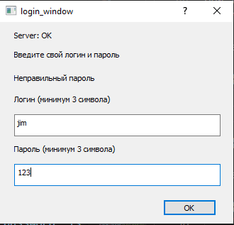
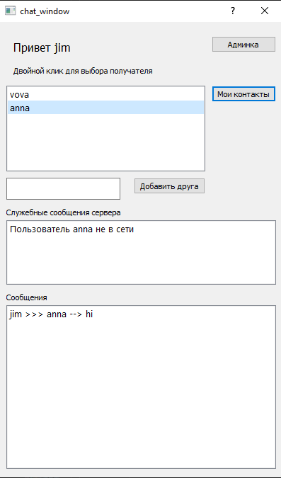
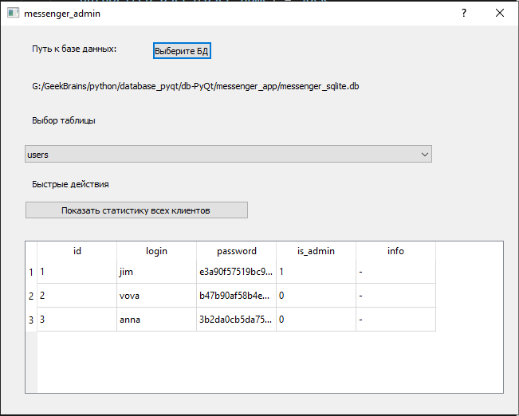
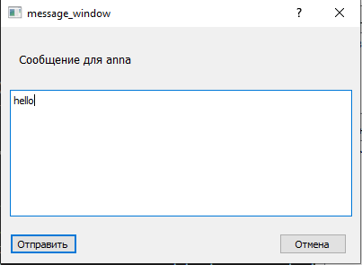

Приложение "Мессенджер"
=======================
Приложение состоит из двух основных модулей:

* server.py
* client_1.py

И одного дополнительного:

* admin.py

Дополнительный модуль может служить для быстрого доступа к БД и ее редактирования.

При использовании приложения в модуле client_1.py доступ к модулю admin.py есть только у администраторов.

Запуск и начало работы
----------------------

Запуск модуля server.py:
``python server.py``

В блоке if __name__ == "__main__":
экземпляру класса Server может быть передан номер порта. 
По умолчанию используется порт 7777

``server = Server()``

**! Важно:** модуль client_1.py без включенного сервера выключится с ошибкой: 'ConnectionRefusedError: Подключение не установлено'.
Поэтому первым необходимо запускать модуль server.py

После успешного запуска модуля server.py происходит создание сокета TCP/IP, и сервер переходит в режим ожидания запросов.

Одновременно с этим сервер создает БД (при первом запуске) или подключается к БД.

При получении запроса на подключение от клиента - сервер посылает случайно сгенерированное сообщение клиенту и ждет ответ.
На стороне клиента и сервера происходит вычисление HMAC-функции.
Далее сравнивается полученное сообщение с тем, что высчитал сервер.
После этого клиенту высылается еще одно сообщение с установлением статуса проверки.
При несовпадении значений клиентская часть выводит сообщение об ошибке и закрывается.

Работа server.py
----------------

При успешной проверке HMAC и авторизации пользователя сервер получает и обрабатывает сообщения по протоколу JIM.
Пароли хранятся в виде hash с добавлением имени пользователя в качестве криптографической соли.

Пример сообщения от клиента::

    {
    "action": "authenticate",
    "time": time.time(),
    "user": {"account_name": user_name, "password": user_pswrd},
    }

Пример ответа сервера::

    {
    "response": 409,
    "time": time.time(),
    "alert": "Неправильный пароль",
    "sock": sock,
    "from": user_name,
    }

Сервер разбирает сообщение и передает его на обработку соответствующей функции.
Функция, по необходимости, делает запрос к БД и готовит ответ для клиента.

Модуль client_1.py
------------------

Клиентская часть имеет графическое оформление состоящее из четырех окон:

* логирование
* главное окно
* окно сообщения
* админка (доступно только для администраторов)

Запуск модуля client.py: 
``python client.py``

В блоке if __name__ == "__main__":
экземпляру класса Client может быть передан номер порта. По умолчанию используется порт 7777

``client = Client()``

После успешного запуска модуля происходит создание сокета TCP/IP и попытка соединиться с сервером.
При соединении с сервером - от него приходит сообщение для проверки HMAC-функции.
Далее приходит еще одно сообщение от сервера с установлением статута.
Если проверка HMAC не пройдена, то в окне логирования получим сообщение: "Сервер отклонил подключение: hmac error",
после чего окно закроется без возможности зарегистрироваться.

В случае успешного прохождения HMAC от пользователя требуется ввести имя и пароль.

Окно логирования выводит сообщения от сервера в случаях:

* проверка HMAC
* неправильный пароль
* уже имеется подключение с логином user_name (можно запустить только одно клиентское приложение на каждое уникальное имя)

В случае первого запуска модуля - первый зарегистрированный пользователь получает статус админа, в дальнейшем он может
назначать администраторов через админку.

Также пользователь вводя логин и пароль, если такого пользователя еще нет в БД - автоматически регистрируется, 
при последующих подключениях требуется указывать тот же пароль, иначе будет ошибка - неправильный пароль.

Пароли хранятся в БД в виде hash.

В главном окне пользователь может добавлять друзей, просматривать список друзей, видит служебные сообщения, 
сообщения свои и адресованные ему.

У администраторов есть кнопка 'админка', позволяющая получить доступ к БД.

Для написания сообщения нужно выбрать двойным кликом адресата из списка друзей.

Работа client_1.py
------------------

После успешного прохождения HMAC и регистрации пользователя, если не получено ошибок типа неправильный пароль и пр., 
открывается главное окно приложения, одновременно с этим запускается Thread на прием сообщений.

Далее на сервер посылаются сообщения по протоколу JIM, полученные ответы от сервера разбираются и выводятся сообщения в 
соответствующее окно приложения.

База данных (БД)
----------------

В проекте используется БД sqlite3
В базе данных (БД) содержатся данные об пользователях, истории входа в приложение, контактах и сообщения пользователей.

Используемые технологии
-------------------------

В приложении применены следующие технологии:

* PyQt5
* Thread
* socket
* hmac
* pickle
* hashlib
* sqlalchemy
* sqlite3
